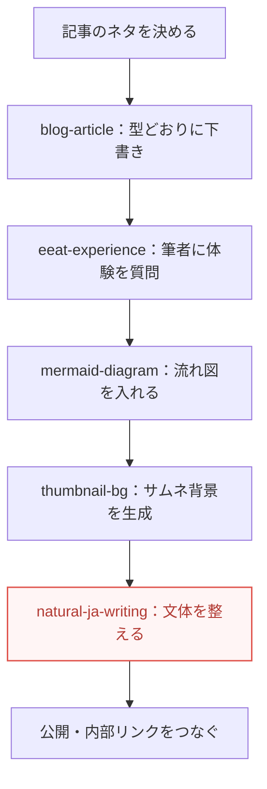

このブログは、記事を書くたびに一から指示を出しているわけではありません。
Claude に「うちのやり方」を手順として覚えさせた、いくつかの<mark>自作スキル</mark>で回しています。

スキルというのは、AI に得意技を覚えさせるしくみのこと（→ [Skills とは何か](/blog/claude-skills-toha/)）。
この記事では、そのスキルを実際にどう使ってこのブログを運営しているのか、制作記録として包み隠さずお見せします。

「AI でブログを続けたいけれど、毎回ブレる・面倒で続かない」という人の、ひとつの実例になればうれしいです。

## なぜ手順を「スキル」にしたのか

正直に言うと、最初から仕組み好きで作ったわけではありません。
きっかけは、<mark>仕事をしながらホームページを更新したかった</mark>ことでした。

平日は本業があります。
ブログにかけられるのは、その合間の細切れの時間だけ。
そんな状態で高頻度に記事を出そうとすると、毎回「トーンはこう、構成はこう、図はこう」と指示を打ち直しているだけで力尽きます。

再現性のある品質を保ったまま、更新の頻度を上げる。
この2つを両立させようとした時点で、手順をスキルに落とすのは選択肢ではなく必須でした。

一度スキルにしてしまえば、次からは「この記事を書いて」と言うだけで、うちの型に沿った下書きが出てきます。
細切れの時間でも前に進める。これが、続けられている一番の理由です。

## 記事を1本出すまでに、どのスキルが動くか

いま、記事を1本公開するまでには、だいたい次の順でスキルが動きます。



それぞれの役割を、かんたんに紹介します。

**blog-article**：このブログの「型」そのもの。
トーン（やさしい・初心者向け）、構成、frontmatter の書き方、カテゴリ登録、内部リンクのルールまでをまとめてあります。
新しい記事は、まずこのスキルの型に沿って下書きされます。

**eeat-experience**：AI が書けない「筆者だけの体験」を混ぜるためのスキル。
書く前に、その記事に必要な一次体験を私に質問してきます。
たとえばこの記事も、「スキルを作り始めたきっかけ」を私に聞いてから書き始めています。憶測で埋めず、実際に聞く。これを手順として強制しているのが肝です。

**mermaid-diagram**：流れや順番を図で見せたいときのスキル。
上のパイプライン図も、このスキルで書いています。文章で直せるので、あとから工程を入れ替えても図がついてきます（→ [AI に図を描かせる](/blog/mermaid-ai/)）。

**thumbnail-bg**：記事のサムネ背景を画像生成 AI で作るスキル。
これは、何度も「サムネを作り忘れて、その記事だけ見た目が不揃いになる」という失敗をしたので、手順として固定しました。`@google/genai` というライブラリが消えていて生成に失敗する、という定番のつまずきも、対処ごと書き込んであります。

## いちばん手放せないのは、文体を整えるスキル

ここまで専用スキルを並べてきましたが、「今これが無いと戻れない」と一番感じているのは、実は汎用の文体スキル `natural-ja-writing` です。
<mark>自然な言葉づかいを、勝手に整えてくれる</mark>のがありがたい。

AI の文章は、油断すると独特の「手癖」が出ます。
`——` で引っ張る締め、「それが◯◯です」という言い換えオチ、見出しの手打ち連番。
放っておくと、どこか翻訳調で、読んでいて鼻につく文になりがちです。

このスキルは、そうした手癖を悪い例→良い例つきで潰してくれます。
しかも、新しい指摘をもらうたびに育てられます。

### 実際にあった話

この記事を書いているまさにその日、私はある文章にダメ出しをしました。
「やることはそれだけです。」のような<mark>言い切って強調する一文</mark>が、AI っぽすぎて気になったのです。

そこで、その場で直すだけで終わらせず、スキルに項目を1つ足しました。
「言い切り強調の独立一文を置かない」という項目です。
直し方まで書いてあります。頭に言葉を足して和らげるのではなく、強調の一文をまるごと消して前の文に畳む、と。

こうしておくと、次からは同じ指摘を私がしなくても、AI が公開前に自分でチェックしてくれます。
一度の気づきを、一度きりで消費しない。この積み重ねが効いてきます。

## 記事づくりの外側にもスキルはある

スキルは、記事を書くためだけのものではありません。
このブログの開発そのものを支える、土台の汎用スキルもあります。


- **spec-driven-dev**：大きめの変更を、いきなり実装せず「仕様→設計→手順」の順でファイルに残しながら進める
- **session-handoff**：作業が途切れても、次のセッションや別のマシンから続きを再開できるようにする
- **judgment-to-skill**：レビューや失敗で得た「これが正解」という基準を、会話で終わらせずスキルに還元する

さきほどの「文体スキルに項目を足した」話は、この judgment-to-skill の考え方そのものです。
機構（AI）は外から借り、判断基準は自分で積み上げていく。この分け方が、ソロで運営していても品質を落とさない支えになっています。

## 自分でも作るなら、小さく始める

こう書くと大がかりに見えますが、最初の1つは驚くほど小さくて構いません。
特別なプログラミングも要らず、「こういう手順でやって」という指示を文章にまとめるだけです。

コツは、いつも同じように打っているお願いを1つ選んで、それを手順として書き出すこと。
私の場合も、最初はブログの型を1枚にまとめただけでした。そこから、失敗するたびに項目が増えていった格好です。

具体的な作り方は、コピペで使えるテンプレート付きで [自分だけの「スキル」を作ってみる](/blog/claude-skill-tsukuru/) にまとめてあります。
仕事や趣味で「毎回同じことを AI に頼んでいるな」と感じたら、それが最初のスキルの候補です。

## スキルの中身を、そのまま載せます

ここからは、実際にこのブログで動いているスキルの中身（`SKILL.md`）を、ほぼそのまま貼っておきます。
初心者の方は読み飛ばして大丈夫です。「本物はどう書いてあるの？」と気になる人向けの、いわば付録です。

自分でスキルを作るときの下敷きにも使えるはずです。
なお、GCP のプロジェクト名など一部の内部情報だけは、伏せ字（`<your-project>`）にしてあります。

### blog-article（記事の型）

このブログの土台。トーン・構成・frontmatter・カテゴリ登録・公開手順までをまとめた、いちばん大きなスキルです。

`````markdown
---
name: blog-article
description: このブログ「0から始める優しいAI生活」（yasashiibai.com、Astro製）の記事を、確立したハウススタイルで新規作成・加筆するためのスキル。やさしい初心者向けトーン、記事の構成、frontmatter、カテゴリ登録、SVG図の作法、内部リンク、公開日/更新日ルール、公開手順までを標準化する。このリポジトリで記事を書く・追加する・既存記事を加筆するときに使う。
---

# ブログ記事スキル（0から始める優しいAI生活）

サイト：**0から始める優しいAI生活**（https://yasashiibai.com 、著者「のこたけ」）。
Claude / Claude Code / AI を、**初心者向けにやさしく**解説するブログ。記事はこの型に沿って書く。

## いつ使う
- `src/content/blog/` に新しい記事を追加するとき
- 既存記事を加筆・修正するとき（→ 公開日/更新日ルールに従う）
- 記事に合わせた図（SVG）を用意するとき

## 執筆トーン（芯）
- **やさしい・初心者向け**。専門用語は必ずその場でかみくだく（例：「インデックス（検索結果への登録）」）。
- **一文一行**で改行し、短く区切る。1段落は2〜4行。
- 読者に寄り添う一人称・語りかけ。押しつけず「〜で十分です」「気が楽になります」と背中を押す。
- 各セクションに**キモとなる一文を1つだけ `<mark>` で強調**（多用しない）。
- 冒頭は「」の問いかけや、あるあるの場面から入る（例：「Claudeって最近よく聞くけれど、結局なに？」）。
- 半角英数と日本語の境目は半角スペースを空ける（例：「Claude Code は」「300 字以内」）。
- 断定しすぎず、正確さを優先（移ろう仕様やバージョン名は深追いしない）。
- **文体の手癖を避ける**。悪い例→良い例は汎用スキル `natural-ja-writing` に集約。このブログにもそのまま適用する。

## 記事の構成
1. **導入**（2〜4段落）：つかみ → 記事で何が分かるか。
2. **冒頭に図を1枚**（本文の早い位置か、該当セクション冒頭）。
3. **本編**：`##` セクションを積む。各セクションは「主張 → 説明 → 具体例/ミニ例」。必要なら表・コードブロック。
4. （任意）**よくある疑問** / **それでもうまくいかないときは** など、実践的な補足。
5. **## まとめ**：要点の再掲 → 前向きな締め →「まずは〜から試してみてください」の一歩。
- **体験・独自要素を20〜30%（必須・E-E-A-T）**：AI が生成できない「筆者だけの中身」を各記事に必ず入れる。
  - 入れるもの：**実際に試した手順・詰まった箇所・失敗談・計測した数値・スクショ・所感**。
  - 置き方：本文中に「### 実際にやってみて」等の小見出しで1ブロック、または各節に一文ずつ体験を織り込む。
  - **嘘は書かない**。体験が無いテーマは筆者の実体験に引きつけるか、正直に「ここは未検証」と書く。
  - **書く前に必ず筆者へ体験をヒアリングする**（1〜3問）。台帳は別スキル `eeat-experience` にまとめてある。
- **画像の頻度：2〜3セクションごとに1枚**を目安に入れる。長い記事ほど効く。詰め込みすぎない。
- **画像の使い分け**：説明は **説明図（SVG）**、雰囲気は **AI画像**（Gemini/Vertex）。基本は説明図を主、AI画像を差し色に。
- **流れ・順番・分岐は Mermaid**：言葉で説明できる図はコードブロックで書く。→ 別スキル `mermaid-diagram`。
- 比較は Markdown の表でまとめる。コードは言語つきコードブロックで。
- 関連する既存記事へ**内部リンク**を貼る。

## カテゴリ登録（必須・忘れやすい）
記事のカテゴリは frontmatter ではなく **`src/consts.ts` の `CATEGORY`（slug→ラベル）で管理**する。
**新記事を足したら必ずここに1行追記する。** 未登録だと「記事」に落ちる。
既存ラベル：`入門` / `使い方` / `開発事例` / `制作記録` / `注意点` / `技術メモ`。

## 内部リンク / URL
- サイトは `trailingSlash: 'always'`。**内部リンクは必ず末尾スラッシュ**。
- 関連記事はシリーズとして相互リンクし、導線を作る。

## 公開日・更新日ルール
- **新規記事**：`pubDate` に公開日（今日）。`updatedDate` は付けない。
- **既存記事の加筆・修正**：`pubDate` は**変えず**、`updatedDate` を修正日にする。

## 公開手順チェックリスト
0. **書く前に、必要な一次体験を筆者へ1〜3問ヒアリング**（→ `eeat-experience`）。
1. `src/content/blog/<slug>.md` を作成（frontmatter＋本文。体験を20〜30%織り込む）。
2. `src/consts.ts` の `CATEGORY` に追記。
3. 必要なら図を置き、説明的な alt で参照。
4. 関連記事へ内部リンク（末尾スラッシュ）。
5. 加筆時は `updatedDate` を更新。
6. **サムネ背景を生成してコミット**（新記事は必須）→ スキル `thumbnail-bg`。
7. `npx astro build` で通ることを確認。
`````

（実際のファイルには、SVG図の細かな配色やビルドコマンドなど、さらに細部まで書いてあります。ここでは要点を抜いて載せています。）

### eeat-experience（体験の聞き取り）

AI が書けない一次体験を、書く前に筆者へ質問して集めるためのスキル。台帳の私的な中身は伏せてあります。

`````markdown
---
name: eeat-experience
description: このブログ「0から始める優しいAI生活」で記事を書く・加筆するとき、E-E-A-T の要である「筆者の一次体験（Experience）」を必ず入れるためのスキル。AIが生成できない体験・独自データ・失敗談・計測値を各記事に20〜30%混ぜる。書きながら、その記事に必要な実体験を筆者へ具体的に質問して集める（憶測で書かない）。
---

# E-E-A-T 体験ヒアリング スキル（0から始める優しいAI生活）

解説だけの記事は評価が伸びない。**AI が書けない「筆者だけの中身」**を各記事に **20〜30%** 混ぜる。
このスキルの肝は、記事を書く前／途中で、必要な一次体験を筆者に必ず聞くこと。ねつ造は絶対にしない。

## 進め方（必ずこの順で）
1. 記事のテーマを確定する。
2. その記事に必要な一次体験を、筆者へ1〜3問だけ質問する。回答を待つ。
3. まず台帳（下の「筆者の実体験メモ」）を確認し、そこにある事実で書ける部分は聞かずに使う。足りない分だけ質問する。
4. もらった回答を「### 実際にやってみて」等のブロックや、各節の一文に仕立てる（合計20〜30%目安）。
5. `blog-article` の作法に沿って仕上げる。加筆なら `updatedDate` を更新。

## 質問の作法
- 1記事につき1〜3問。1問は1〜2行で答えられる具体的な問いにする。
- 引き出すのは「実際に試したこと／詰まった箇所／失敗談／計測した数値／所感」。
- 答えの無いテーマは、台帳の実体験に引きつけるか、正直に「未検証」と書く。でっち上げない。

## 筆者の実体験メモ（台帳・確認済みの事実）
まずここを使う。ここに無い or 記事に足りない具体だけを筆者に質問する。

（※ここには筆者の本業・料金・モデルの使い分け・失敗談といった私的な一次情報が並びます。プライバシーのため、本記事では中身を省略しています。）

## Do / Don't
- **Do**：書く前に必ず1〜3問ヒアリング。台帳で埋まる所は聞かない。
- **Don't**：体験をねつ造しない。無い体験は台帳へ引きつけるか「未検証」と正直に書く。
`````

### natural-ja-writing（文体を整える）

今いちばん手放せない、汎用の文体スキル。冒頭で触れた「それだけです」問題で、項目6が増えたばかりです。

`````markdown
---
name: natural-ja-writing
description: 日本語の記事・コラム・ブログ本文を書く／推敲するときに、AIっぽい・翻訳調の手癖を避けて自然な文体にするためのスキル。ダッシュ締め（——）、指示語オチ（それが/これが◯◯です）、言い切り強調の独立一文（それだけです/これだけです）、先出しの「N個挙げます」宣言、見出しの手打ち連番、同型のセクション導入などを、悪い例→良い例つきで是正する。
---

# 自然な日本語の文体スキル（汎用）

AI が書きがちな「翻訳調・説明くさい・定型的」な手癖を避け、**普通の書き手が書いた自然な日本語**にするのが目的。
実際に筆者から「鼻につく」「キモい」「重複してる」と指摘された手癖を、悪い例→良い例で残す。

## 1. ダッシュ締め（——）を使わない
- 悪い：「…相棒に変わっていく——それが正体です。」
- 良い：「…相棒へと変わっていきます。」（普通に言い切って止める）

## 2. 指示語オチ（それが/これが/そんな◯◯です）を多用しない
- 悪い：「…変わっていく。それがエージェントの正体です。」
- 良い：「…変わっていきます。」（一文に統合、または言い切り）
- ただし「これがコツです」のような短く自然な用法・定義・接続語は可。

## 3. 先出しの「これから N 個挙げます」宣言を、わざとらしく書かない
- 悪い：「実際に効いたのは、この 5 つでした。」／「効いたコツを 5 つに絞りました。」
- 良い：「なぜ効くのかと一緒に見ていきましょう。」／列挙後に「以上の 5 つが…」と受ける。

## 4. 見出しに手打ちの連番を入れない（採番が自動のとき）
- 悪い：`## 1. 最後は人が決める`（自動採番と二重になる）
- 良い：`## 最後は人が決める`（採番はレイアウトに任せる）

## 5. 各セクションの入りを同じ型で書かない
- 悪い：全部「N つめは、〜です」で始める。
- 良い：言い切り／体言止め／問いかけ→答え／具体例から入る、などを混ぜる。

## 6. 言い切り強調の独立一文（それだけです／これだけです）を置かない
直前の内容を短い一文で受け直して強調する型は、AI 特有の大げさな強調になりやすい。
- 悪い：「…テキストに起こす。それだけです。」（語を足しても構造は同じ）
- 良い：強調の一文をまるごと消し、前の文に畳む（「…テキストに起こしてくれます。」）。
- 直し方の要点：頭に語を足して和らげるのではなく、独立した強調文を削除する。

## 使い方
- 書き終えたら／直すときに、上の6点を一通り見る。とくに `——`・「それが◯◯です」・「それだけです」・見出しの手打ち番号は検索して潰す。
- 新しい手癖の指摘をもらったら、この一覧に悪い例→良い例で追記して育てる。
`````

### mermaid-diagram（流れ図）

流れや順番を、テキストで書いて図にするスキル。日本語ラベルの落とし穴を避ける約束事が肝です。

`````markdown
---
name: mermaid-diagram
description: このブログ「0から始める優しいAI生活」（Astro製）で、Mermaid のコードから図を描くためのスキル。フローチャート・シーケンス図・状態遷移などを、テキストで書いて記事内に埋め込む。日本語ラベルの落とし穴、ブランド配色との整合、SVG図との使い分け、貼り方までを標準化する。
---

# Mermaid 図スキル（0から始める優しいAI生活）

**流れ・順番・分岐・関係**を見せたいときは Mermaid、**きれいなレイアウトや比喩的な絵**は SVG、と使い分ける。
迷ったら：言葉で「AがBして、次にCする」と説明できる図は Mermaid。位置やデザインが主役なら SVG。

## 書き方の型（フローチャート）
- 向き：`TD`（上→下）か `LR`（左→右）。スマホは縦長になりやすいので、横に長い流れは `TD`。
- ノード形：四角 / 角丸 / ひし形＝分岐。分岐の矢印にはラベルを付けられる。

## 日本語ラベルの落とし穴（重要）
- **ラベルは必ずダブルクオートで囲む。** 特に丸カッコ・コロン・スラッシュ・半角スペースを含むと崩れやすい。
- 記号は全角に逃がすと安定（`()`→`（）`、`:`→`：`）。
- 1ノードが長いと横に伸びる。10〜16 文字を目安に、長い説明は改行で分ける。
- ノード ID は半角英数。日本語は必ずラベル側（クオートの中）へ。

## Do / Don't
- **Do**：図は 5〜9 ノード程度に抑える。多いと読めない → 分割するか SVG にする。
- **Do**：図の直前か直後に一文で図の要点を書く（Mermaid は画像として検索に載りにくいので本文で補う）。
- **Don't**：色を個別指定してブランド配色を崩さない。巨大な1枚に詰め込まない。
`````

### thumbnail-bg（サムネ背景）

記事のサムネ背景を画像生成 AI で作るスキル。何度もやらかした「作り忘れ」対策として、手順を固定してあります。

`````markdown
---
name: thumbnail-bg
description: このブログ「0から始める優しいAI生活」（Astro製）で、新記事のサムネ背景を画像生成AI（Vertex/Gemini）で作るためのスキル。記事内容が一目で伝わる写真的な背景を public/thumb-bg/<slug>.webp に生成→コミットする。新しい記事を追加したら必ず実行する（他記事と系統をそろえるため）。
---

# サムネ背景スキル（0から始める優しいAI生活）

新記事を足したら、**本文だけでなくサムネ背景（thumb-bg）も必ず作る。**
これを忘れると、その記事だけグラデーションのサムネになり、他記事と不揃いになる。

## 仕組み（2段構え）
- **背景**：`scripts/genThumbBg.mjs` が Vertex/Gemini で背景画像を生成（ローカル手動・要課金）。コミットする。
- **合成**：`scripts/genThumbnails.mjs` がタイトル＋カテゴリpillを重ねて OG 画像を作る（デプロイ時に自動生成）。
- ビルドでは合成だけを叩く。背景生成はビルドで叩かない（毎回課金・毎回別の絵になる）。

## 手順（新記事1本ぶん）

### 1. 前提：@google/genai を入れ直す（重要な落とし穴）
package.json に載っていないので、npm install で余分扱いされて消える。実行前に毎回入れ直す：

    npm install @google/genai --no-save --no-audit --no-fund

### 2. 背景を生成（ADC 認証）

    GOOGLE_GENAI_USE_VERTEXAI=true GOOGLE_CLOUD_PROJECT=<your-project> node scripts/genThumbBg.mjs <slug>

- 冪等：既に背景があればスキップ。作り直すなら末尾に --force。
- プロンプトは記事のタイトル＋説明から自動生成。文字は描かせない設計（左3分の1はタイトル用に空ける）。

### 3. 目視チェック（必須）
- 崩れた文字・変なロゴ・製品名が写り込んでいないか（写ったら --force で引き直す）。
- 主題が一目で伝わるか。左側にタイトルが乗るスペースがあるか。

### 4. コミット＆デプロイ
背景をコミットして push すると、ビルドがこの背景で OG サムネを合成する。

## Do / Don't
- **Do**：新記事を publish する流れの最後で、必ず背景生成まで通す。
- **Don't**：背景生成をビルド/CI で叩かない。鍵を git に入れない。
`````

この記事も、まさにこの `thumbnail-bg` でサムネを作り、1回目に崩れ文字が出たので引き直しています。

## まとめ

このブログは、Claude に覚えさせた自作スキルで運営しています。

- きっかけは、仕事の合間に高頻度で更新したかったこと。再現性と頻度の両立には、手順のスキル化が必須だった
- 記事1本の裏では、下書き・体験の聞き取り・図・サムネ・文体調整のスキルが順に動いている
- いちばん手放せないのは、文体を自然に整えてくれるスキル。失敗や指摘のたびに育てている

いきなり全部そろえる必要はありません。
まずは、いつも AI に頼んでいることを1つ、手順として書き出してみてください。
そこから少しずつ、あなた専用の「型」が育っていきます。
