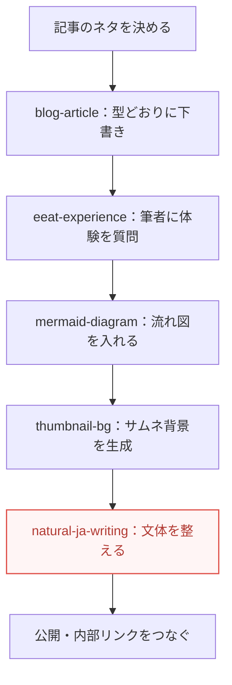

このブログは、記事を書くたびに一から指示を出しているわけではありません。
Claude に「うちのやり方」を手順として覚えさせた、いくつかの<mark>自作スキル</mark>で回しています。

スキルというのは、AI に得意技を覚えさせるしくみのこと（→ [Skills とは何か](/blog/claude-skills-toha/)）。
この記事では、そのスキルを実際にどう使ってこのブログを運営しているのか、制作記録として包み隠さずお見せします。

「AI でブログを続けたいけれど、毎回ブレる・面倒で続かない」という人の、ひとつの実例になればうれしいです。

## なぜ手順を「スキル」にしたのか

正直に言うと、最初から仕組み好きで作ったわけではありません。
きっかけは、<mark>仕事をしながらホームページを更新したかった</mark>ことでした。

平日は本業があります。
ブログにかけられるのは、その合間の細切れの時間だけ。
そんな状態で高頻度に記事を出そうとすると、毎回「トーンはこう、構成はこう、図はこう」と指示を打ち直しているだけで力尽きます。

再現性のある品質を保ったまま、更新の頻度を上げる。
この2つを両立させようとした時点で、手順をスキルに落とすのは選択肢ではなく必須でした。

一度スキルにしてしまえば、次からは「この記事を書いて」と言うだけで、うちの型に沿った下書きが出てきます。
細切れの時間でも前に進める。これが、続けられている一番の理由です。

## 記事を1本出すまでに、どのスキルが動くか

いま、記事を1本公開するまでには、だいたい次の順でスキルが動きます。

それぞれの役割を、かんたんに紹介します。

**blog-article**：このブログの「型」そのもの。
トーン（やさしい・初心者向け）、構成、frontmatter の書き方、カテゴリ登録、内部リンクのルールまでをまとめてあります。
新しい記事は、まずこのスキルの型に沿って下書きされます。

**eeat-experience**：AI が書けない「筆者だけの体験」を混ぜるためのスキル。
書く前に、その記事に必要な一次体験を私に質問してきます。
たとえばこの記事も、「スキルを作り始めたきっかけ」を私に聞いてから書き始めています。憶測で埋めず、実際に聞く。これを手順として強制しているのが肝です。

**mermaid-diagram**：流れや順番を図で見せたいときのスキル。
上のパイプライン図も、このスキルで書いています。文章で直せるので、あとから工程を入れ替えても図がついてきます（→ [AI に図を描かせる](/blog/mermaid-ai/)）。

**thumbnail-bg**：記事のサムネ背景を画像生成 AI で作るスキル。
これは、何度も「サムネを作り忘れて、その記事だけ見た目が不揃いになる」という失敗をしたので、手順として固定しました。`@google/genai` というライブラリが消えていて生成に失敗する、という定番のつまずきも、対処ごと書き込んであります。

## いちばん手放せないのは、文体を整えるスキル

ここまで専用スキルを並べてきましたが、「今これが無いと戻れない」と一番感じているのは、実は汎用の文体スキル `natural-ja-writing` です。
<mark>自然な言葉づかいを、勝手に整えてくれる</mark>のがありがたい。

AI の文章は、油断すると独特の「手癖」が出ます。
`——` で引っ張る締め、「それが◯◯です」という言い換えオチ、見出しの手打ち連番。
放っておくと、どこか翻訳調で、読んでいて鼻につく文になりがちです。

このスキルは、そうした手癖を悪い例→良い例つきで潰してくれます。
しかも、新しい指摘をもらうたびに育てられます。

### 実際にあった話

この記事を書いているまさにその日、私はある文章にダメ出しをしました。
「やることはそれだけです。」のような<mark>言い切って強調する一文</mark>が、AI っぽすぎて気になったのです。

そこで、その場で直すだけで終わらせず、スキルに項目を1つ足しました。
「言い切り強調の独立一文を置かない」という項目です。
直し方まで書いてあります。頭に言葉を足して和らげるのではなく、強調の一文をまるごと消して前の文に畳む、と。

こうしておくと、次からは同じ指摘を私がしなくても、AI が公開前に自分でチェックしてくれます。
一度の気づきを、一度きりで消費しない。この積み重ねが効いてきます。

## 記事づくりの外側にもスキルはある

スキルは、記事を書くためだけのものではありません。
このブログの開発そのものを支える、土台の汎用スキルもあります。

- **spec-driven-dev**：大きめの変更を、いきなり実装せず「仕様→設計→手順」の順でファイルに残しながら進める
- **session-handoff**：作業が途切れても、次のセッションや別のマシンから続きを再開できるようにする
- **judgment-to-skill**：レビューや失敗で得た「これが正解」という基準を、会話で終わらせずスキルに還元する

さきほどの「文体スキルに項目を足した」話は、この judgment-to-skill の考え方そのものです。
機構（AI）は外から借り、判断基準は自分で積み上げていく。この分け方が、ソロで運営していても品質を落とさない支えになっています。

## 自分でも作るなら、小さく始める

こう書くと大がかりに見えますが、最初の1つは驚くほど小さくて構いません。
特別なプログラミングも要らず、「こういう手順でやって」という指示を文章にまとめるだけです。

コツは、いつも同じように打っているお願いを1つ選んで、それを手順として書き出すこと。
私の場合も、最初はブログの型を1枚にまとめただけでした。そこから、失敗するたびに項目が増えていった格好です。

具体的な作り方は、コピペで使えるテンプレート付きで [自分だけの「スキル」を作ってみる](/blog/claude-skill-tsukuru/) にまとめてあります。
仕事や趣味で「毎回同じことを AI に頼んでいるな」と感じたら、それが最初のスキルの候補です。

## まとめ

このブログは、Claude に覚えさせた自作スキルで運営しています。

- きっかけは、仕事の合間に高頻度で更新したかったこと。再現性と頻度の両立には、手順のスキル化が必須だった
- 記事1本の裏では、下書き・体験の聞き取り・図・サムネ・文体調整のスキルが順に動いている
- いちばん手放せないのは、文体を自然に整えてくれるスキル。失敗や指摘のたびに育てている

いきなり全部そろえる必要はありません。
まずは、いつも AI に頼んでいることを1つ、手順として書き出してみてください。
そこから少しずつ、あなた専用の「型」が育っていきます。
