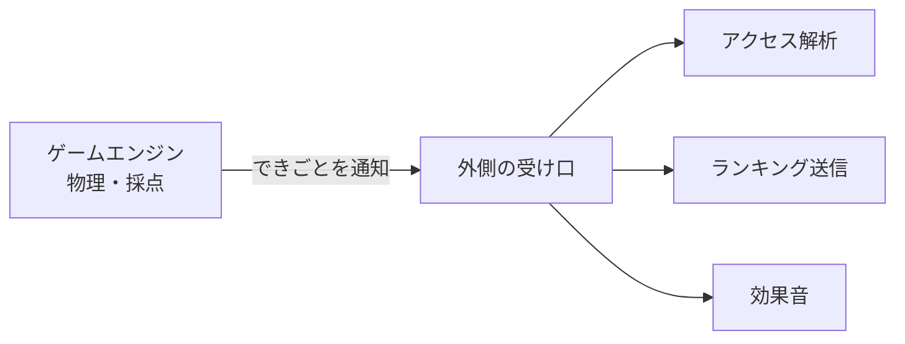

二重振り子（にじゅうふりこ）って、見たことがありますか。

棒の先に、もう一本ぶらさげただけの単純な仕掛けです。
なのに動かすと、次にどこへ跳ねるのかまるで読めません。ずっと眺めていられる、あの不思議な動きです。

その「読めなさ」が面白くて、同時にちょっとイライラする。
だったら、そのイライラごと遊びにしてしまえばいい。
そう思って、暴れる二重振り子を狙った場所でピタッと止めるミニゲームを作りました。

この記事は、そのゲームを AI と一緒に作った制作記録です。
うまくいったところも、まだ崩れているところも、正直に書いていきます。

## どんなゲームなのか

ルールはとても単純です。

暴れ続ける二重振り子の先端を、画面のどこかに現れる黄色い丸の中で止める。
それだけを、全5ラウンド・各15秒でくり返します。
的のど真ん中に近いほど高得点で、1ラウンド0〜100点、合計500点満点です。

止める操作は「止める」ボタンでも、画面タップでも、スペースキーでもかまいません。
問題は、狙った瞬間には振り子がもう別の場所へ行っている、という一点だけです。

## なぜ二重振り子だったのか

正直に言うと、今回は実益をまったく考えていません。

このブログでは、これまで [検索から仕事につながった事業所ページ](/blog/shoshinsha-hitokara-tsukutta/) や、[詐欺検知 AI「KangaL」](/blog/kangal-kaihatsu-jirei/) のように、「役に立つもの」を作った話が多めでした。
でも今回のきっかけは、もっと素朴です。二重振り子の動きが面白かった。ただそれだけでした。

<mark>思いどおりにならないものを、思いどおりにしようとする。そのもどかしさ自体が、遊びとしていちばん面白いところだと思ったのです。</mark>

止まってほしいのに止まらない。
惜しいところで通り過ぎる。
その理不尽さで笑えたら、それはもう立派なゲームです。

## まず「動くもの」を一枚で作った

作り始めは、凝ったことをしていません。

最初に用意したのは、ファイル1枚で完結する素朴な HTML でした。
物理の計算と、的との距離で点を出す採点、この2つだけを先に固めて、とにかく画面の中で振り子を暴れさせる。
遊びの手ごたえは、ここでほぼ決まります。

振り子の動きには、RK4（ルンゲ＝クッタ法）という、なめらかに動きを追いかける計算方法を使いました。
名前はいかついのですが、要は「カクカクさせずに、次の一瞬の位置をていねいに求める」しくみです。
このあたりは AI に土台を書いてもらいながら、動きが破綻しないところまで一緒に詰めました。

## 遊びの心臓は触らず、服だけ着替えさせた

素朴な HTML で手ごたえが出たあと、このブログ（Astro 製）に載せる作業に移ります。

ここで一つだけ、自分に約束したことがあります。
<mark>面白さが決まっている物理と採点の部分には、もう指一本ふれない。</mark>
載せ替えのついでに動きをいじると、せっかく決まった手ごたえが静かに崩れるからです。

そこで、ゲームの本体（エンジン）を、ブログや広告や計測のことを何も知らない「純粋な部品」として切り離しました。
エンジンは遊びを回すことだけに集中して、外に伝えたいこと（ゲーム開始・ラウンド終了・スコア確定）は、受け口にポンと渡すだけ。
その先で計測やランキングにつなぐかどうかは、外側の世界で決めます。

こうしておくと、あとで別の場所（ゲーム配信サイトなど）へ持ち出したくなっても、心臓部をそのまま連れて行けます。
このブログを回している [自作スキル](/blog/blog-jisaku-skill/) のときにも感じたことですが、「あとで動かせるように、役割を分けておく」のは、AI と作るときほど効いてきます。

## ランキングは Cloudflare で、こっそり見張りつき

せっかくスコアが出るなら、みんなで競いたい。
そこで、オンラインのランキングも用意しました。

保存先は Cloudflare の小さなデータベース、送受信は同じ Cloudflare の小さなプログラムに任せています。
このブログと同じ場所で完結するので、別のサーバーを借りずに済みました。

一つだけ気をつけたのは、送られてきたスコアをそのまま信じないことです。
ラウンド数や点数のつじつまが合わない申告は、受け口の側で軽くはじくようにしました。
きびしいカンニング対策まではしていませんが、明らかにおかしい数字は通さない、くらいの見張りです。
なお、順位に必要のない個人情報（IP アドレスなど）は保存していません。

ちなみに本番の接続そのものは、まだ最後のスイッチを入れる前の段階です。
仕組みは組み終わっているので、ここは近いうちに切り替えます。

### 正直な話、難易度はまだ崩れている

ここが、この記事でいちばん正直に書きたかったところです。

遊んでみると分かるのですが、今の難易度はまだ整っていません。
二重振り子は、ほんの少しのタイミングのズレで結果が大きく変わります。
そのカオスさが売りではあるのですが、いまは的が小さすぎたり、暴れ方が激しすぎたりで、理不尽に感じる場面が正直あります。

的の大きさ、採点のゆるさ、振り子の初速。
このあたりを少しずつ動かして、「悔しいけど、もう一回」と思える手前で止める。
その調整は、これからの宿題です。
崩れたまま出すのは気が引けましたが、遊びなので、直しながら育てるくらいがちょうどいいと思っています。

## まとめ

最後に、今回の制作を短く振り返ります。

- 二重振り子の「読めない動き」を、狙って止める遊びにした。
- まず HTML 1枚で手ごたえを固め、物理と採点には二度とふれずにブログへ載せ替えた。
- ランキングは Cloudflare で完結させ、おかしなスコアだけ軽くはじくようにした。
- 難易度はまだ調整中で、いまは理不尽なくらい。ここは直しながら育てていく。

役に立つものではありません。
でも、思いどおりにならないものと格闘する時間は、それはそれで悪くないものです。
[カオス振り子ストップ](/games/chaos-pendulum/) で、あなたは何点取れるでしょうか。まずは1回、暴れる振り子に付き合ってみてください。
