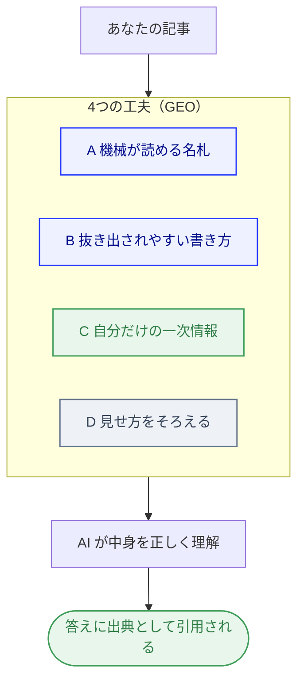

「SEO（検索で上位に出す工夫）」は、聞いたことがあるかもしれません。

でも最近、検索の入り口そのものが変わってきました。

Google だけでなく、ChatGPT や Perplexity、Google の AI Overviews（検索結果の上に出る AI のまとめ）が、<mark>その場で「答え」を作って見せる</mark>ようになったからです。

すると、新しい勝負どころが生まれます。

「その答えの中で、自分のサイトが引用されるかどうか」です。

この記事では、まず前半でその考え方をやさしく整理し、後半で、私が自分の仕事のサイトで実際にやっている対策を紹介します。

## 「順位」から「引用」へ — SEO・GEO・AIO の違い

まず、言葉をほどいておきましょう。

- **SEO**：検索結果で**上位に出す**ための工夫。
- **GEO**（Generative Engine Optimization）：AI の答えに**引用される**ための工夫。
- **AIO**（AI Optimization）：GEO とほぼ同じ意味で使われる言い方です。

いちばんの違いは、ゴールの形です。

SEO が「検索結果の一覧で、上のほうに並ぶ」ことを目指すのに対し、GEO は「AI が作る答えの中で、出典として名前を出してもらう」ことを目指します。

<mark>「順位」を取りにいくのが SEO、「引用」を取りにいくのが GEO</mark>。そう考えると、すっきりします。

とはいえ、土台（中身のよさ・読みやすさ）は同じです。
GEO は、その上に「AI が抜き出しやすい形」を少し足すだけ。
まったく別物を覚え直すわけではありません。

## 実は私、仕事のサイトで GEO 対策をやっています

ここからが後半、実践編です。

私は本業のかたわら、[自分で立ち上げた仕事のサイト](/blog/shoshinsha-hitokara-tsukutta/)を運営しています。

そこで実際にやっている GEO 対策を整理すると、大きく 4 つの層に分けられました。

↑ 記事を「4つの工夫」で整えると、AI が中身を正しく理解し、答えの出典として引用してくれます。上の図がその流れです。

むずかしそうに見えますが、初心者語に翻訳すれば、どれも「なるほど」という話です。
順番に見ていきましょう。

## 層A：AI に「これは何の情報か」を教える名札

1 つめは、ページに<mark>「これは何の情報か」を機械が読める名札を付けておく</mark>ことです。

人が見る見た目とは別に、裏側で「これは会社の情報」「これは記事」「これは Q&A」と、こっそり名札を添えておくイメージです。

こうしておくと、AI がページの中身を正しく受け取りやすくなります。

専門的には「構造化データ」という仕組みを使いますが、中身のコードは、いまは知らなくて大丈夫。
<mark>「名札を付けると AI が内容を正しく読める」</mark>。それだけ押さえれば十分です。

ひとつだけ、大事な心がまえがあります。
**日付を盛らないこと**です。

私はサイトの公開日・更新日を、実際の日付そのままで出しています。
新しく見せようと日付をいじると、いつか AI 側にバレて、逆に信頼を落とすからです。
この姿勢は [ハルシネーション（AI のそれっぽい嘘）](/blog/ai-hallucination-toha/)で書いた「盛らない」考え方と地続きです。

（ちなみに、いま読んでいるこのブログでも、同じ考えで記事・FAQ・パンくずの名札を付けています。）

## 層B：AI に抜き出されやすい書き方（いちばん真似しやすい）

2 つめは本文の書き方です。
特別なツールは要りません。**書き方を整えるだけ**で効くので、<mark>自分のブログにいちばん真似しやすいパート</mark>です。

図の 5 つを、なぜ効くのかと一緒に見ていきましょう。

1. **見出しの直後に、結論を1文で置く**：「〇〇とは、〜のことです」と先に言い切る。AI は冒頭の一文を、答えにそのまま使いやすいからです。
2. **箇条書きより、表にする**：「方法 × わかること × 限界」のように並べる。表は、AI がまるごと引用しやすい最強のフォーマットです。
3. **質問形の見出しにする**：「〇〇が見つかった。次に何をすべき？」。ユーザーが AI に打ち込む質問そのままの形にします。
4. **表記ゆれを吸収する**：「はんだ／半田／ハンダ、いずれも同じ」と本文で明示する。書き方の違う検索すべてに一致します。
5. **数値や式を明記する**：「割れ率 ＝ 割れの長さ ÷ 全長 × 100」のように。具体的な数字は引用されやすいのです。

どれも、今日の記事からすぐ足せます。
とくに最初の 3 つは、覚えておくだけで文章が変わります。

## 層C：あなただけの一次情報こそ、AI は引用したがる

3 つめは、中身の信頼性です。

ネットに転がっている一般論を、きれいに言い換えただけの記事。それは、AI にとって「どこにでもある情報」です。

わざわざ引用する理由がありません。

逆に AI が引用したがるのは、<mark>そこにしか無い一次情報</mark>です。

私のサイトなら、現場で積み上げた測定の基準や、判定のコツ。
あなたのブログなら、実際に試した手順、詰まった箇所、計測した数字、失敗談。

そして、もうひとつ大事なのが**捏造しないこと**です。

私は、まだ実データが無いところを、それっぽい数字で埋めません。
「ここは要・実データ」と正直に印を置いておき、本物がそろってから入れます。

一見すると遠回りですが、この<mark>「無いものは無いと書く」姿勢そのものが、誠実さの証明</mark>になります。
薄い平均的な記事を量産しないことが、GEO の生命線です。

（このブログでも、記事には必ず筆者の一次体験を入れる、というルールで書いています。）

## 層D：見せ方をそろえる（メタ整合）

4 つめは、細かいけれど地味に効く「そろえる」作業です。

AI は、ページのタイトルや説明文を「要約の候補」として使います。
だから、そこがバラバラだと拾われ方が安定しません。

- ページのタイトルと、SNS 共有時に出る見出しをそろえる
- 正規の URL（canonical）を 1 つに決める

ここは深入りしなくて大丈夫。
「表と裏で言っていることを、ちぐはぐにしない」。それだけ意識すれば十分です。
URL の正規化については [末尾スラッシュと canonical の話](/blog/trailing-slash-canonical/)も参考になります。

## 実際にやってみて — 効いた順番

正直な実感を書いておきます。

いちばん効いたのは、**層B（書き方）と層C（一次情報）**でした。

名札（層A）や見せ方（層D）は「土台」で、無いと土俵に上がりにくい。
でも、それだけで引用が増えるわけではありません。

最後にものを言うのは、<mark>「自分だけの本物の情報を、AI が抜き出しやすい形で、正直に出す」</mark>。結局これに尽きました。

日付やデータを盛らなかったことも、遠回りに見えて、長い目での信頼になりました。

## まとめ

GEO / AIO は、AI の答えに「引用される」ための工夫です。
「順位」を取る SEO の、次の一歩だと考えてください。

- **層A**：AI に「これは何の情報か」を教える名札を付ける。日付は盛らない
- **層B**：結論を先に・箇条書きより表・質問形の見出しで、抜き出されやすくする
- **層C**：あなただけの一次情報を、捏造せず正直に書く
- **層D**：タイトルや URL の見せ方をそろえる

むずかしく身構える必要はありません。

まずは 1 記事、<mark>「見出しの直後に結論を1文」から</mark>試してみてください。
それだけで、AI にも人にも、ぐっと伝わりやすくなります。

公開後に AI や検索へ知らせる手順は、[記事を公開したら最初にやること](/blog/search-console-nyumon/)にまとめています。
