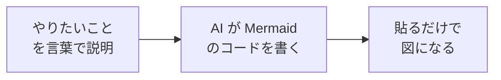
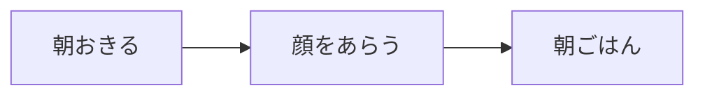
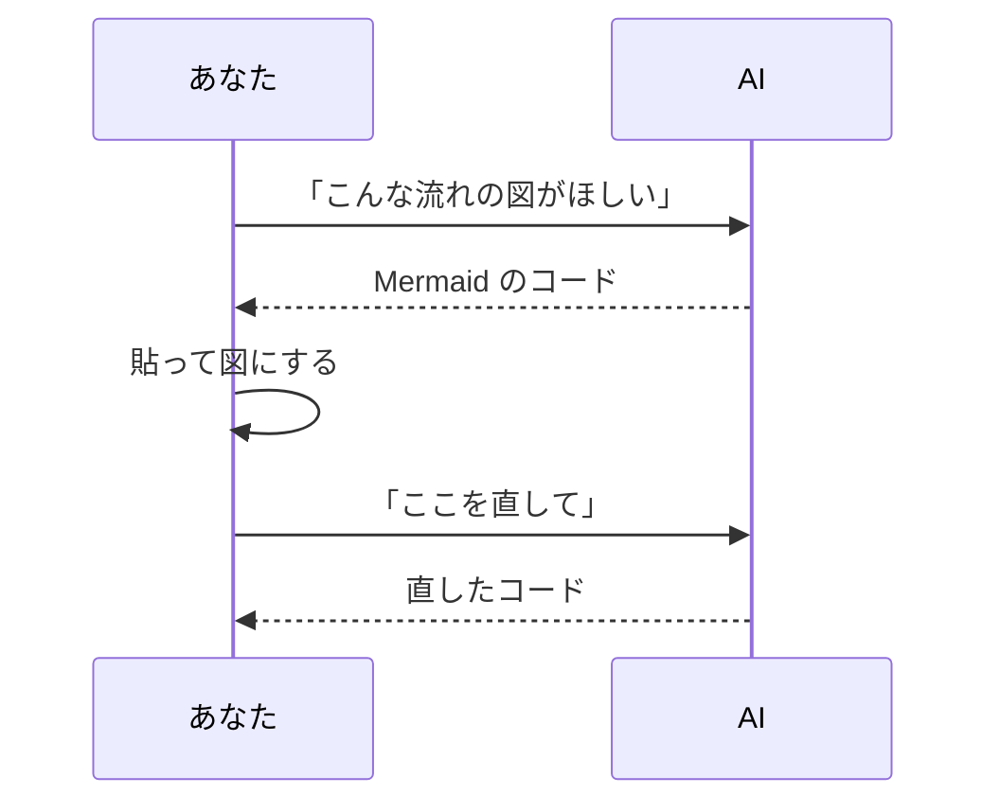
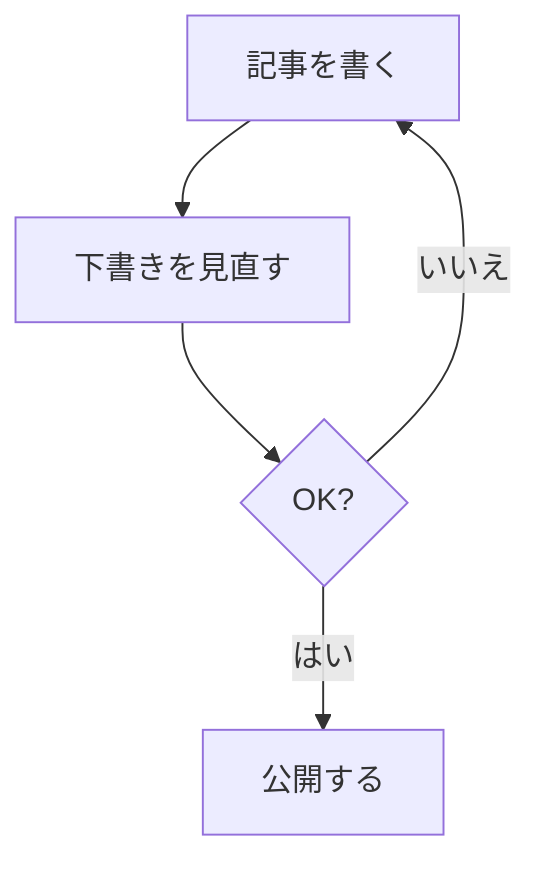
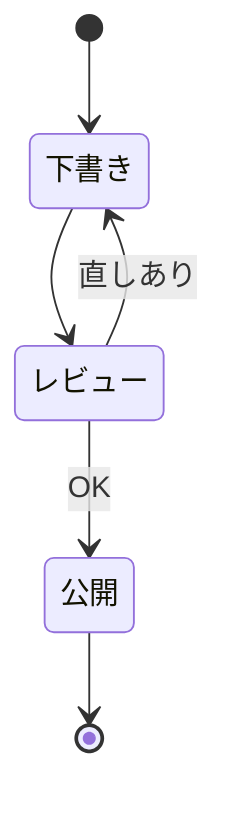
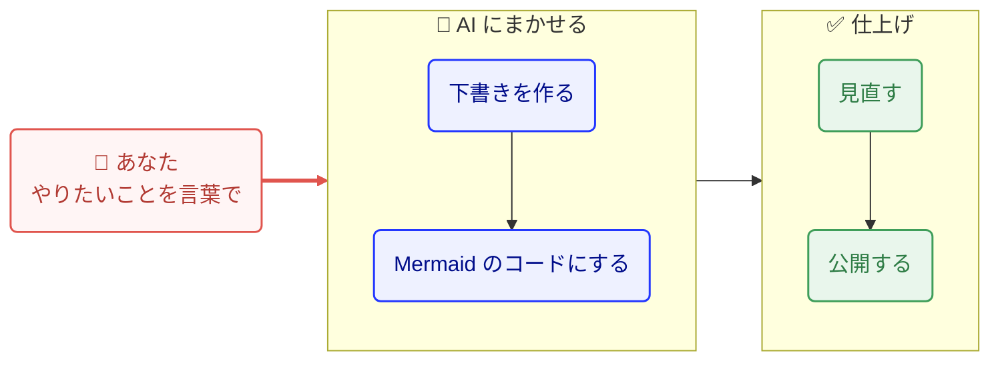

「この流れ、図にすると一目で分かるのに」。

そう思っても、いざ図を作ろうとすると腰が重くなりませんか。

線を引いて、四角を並べて、位置をそろえて……。

そんな面倒をまるごと省いてくれるのが **Mermaid（マーメイド）** です。

Mermaid は、**図を「絵」ではなく「文章」で書くしくみ**。

そしてこの書き方は、**AI がとても得意**です。

この記事では、AI に図を描かせるやり方と、日本語で崩れないコツ、そして一度作った手順を繰り返し使うための工夫までを、やさしく紹介します。



↑ この記事の流れそのものです。「言葉で頼む → AI がコードにする → 貼れば図になる」。この3ステップを、これから順に見ていきます。

## Mermaid とは — 図を「文章」で書くしくみ

Mermaid は、決まった書き方（テキスト）で図を表すためのしくみです。

たとえば「A から B へ矢印」を引きたいとき、こう書きます。



`-->` が矢印、`["…"]` が四角い箱です。

位置やサイズは**自動でそろう**ので、こちらは「何と何がつながるか」だけを書けば済みます。

<mark>Mermaid は「線を引く」のではなく「つながりを説明する」道具です。</mark>

だから、絵心がなくても、マウスで線を引かなくても、図が作れます。

この記事の図も、すべてこの方法で書いています。

## なぜ AI と相性がいいのか

図を絵として描くのは、AI にとって苦手な作業です。

でも Mermaid は図が**文章（コード）**なので、話が変わります。

文章を書くのは、AI がいちばん得意なこと。

だから「こういう流れの図がほしい」と言葉で頼めば、AI がスラスラと Mermaid のコードを書いてくれます。

あなたはそれを**コピーして貼るだけ**。

図の修正も「3番目の箱を2つに分けて」と言えば直してくれます。

手で描き直す必要がありません。



↑ あなたと AI のやり取りは、こんなキャッチボールになります。

うまく頼むコツは [AI への頼み方](/blog/prompt-no-kotsu/) の記事も参考にしてください。

## 実際にやってみる — AI へのお願いの仕方

むずかしく考えなくて大丈夫です。

次のように、**普通の言葉で頼むだけ**で十分です。

```text
次の流れを Mermaid のフローチャートにしてください。
日本語のラベルは "…" で囲んでください。

・記事を書く
・下書きを見直す
・OK なら公開、ダメなら書き直しに戻る
```

すると、AI はこんなコードを返してくれます。



`{"…"}` のひし形は「分かれ道（分岐）」を表します。

`-->|はい|` のように、矢印にラベルを付けられます。

ポイントは1つだけ。<mark>頼むときに「日本語ラベルは "…" で囲んで」と一言そえること。</mark>

これだけで、後で紹介する「崩れる」トラブルの大半を防げます。

## 図の種類 — まずはこの3つ

Mermaid にはたくさんの図がありますが、初心者はこの3つを知っていれば十分です。

| 図の種類 | 何を表す | こんなときに |
| --- | --- | --- |
| フローチャート | 処理の流れ・分岐 | 手順やしくみを説明する |
| シーケンス図 | やり取りの順番 | 「誰が誰に何をする」を並べる |
| 状態遷移図 | 状態の移り変わり | 「下書き→公開」のような段階 |

フローチャートとシーケンス図は、もう上で見ました。

3つ目の**状態遷移図**は、こう書きます。



記事が「下書き → レビュー → 公開」と進み、直しがあれば下書きに戻る、という移り変わりを表しています。

どれを使えばいいか迷ったら、**「言葉で順番に説明できる図はフローチャート」**から始めれば大丈夫です。

## 日本語で崩れないための注意点

Mermaid でいちばんつまずくのが、**日本語ラベルの崩れ**です。

でも、原因はだいたい決まっています。

- **ラベルを "…" で囲んでいない**。特に `( )` `:` `/` などの記号やスペースが入ると崩れます。
- **記号が半角のまま**。`(CLI)` のような半角カッコは、全角の `（CLI）` に逃がすと安定します。
- **1つの箱が長すぎる**。横に伸びて読みにくいときは、`<br/>` で改行します。

たとえば、崩れやすい書き方と、直した書き方はこうです。

```text
悪い例： A[Claude Code (CLI) を使う]
良い例： A["Claude Code（CLI）を<br/>使う"]
```

<mark>「崩れたら、まず "…" 囲みと記号の全角化を疑う」。これだけ覚えておけば十分です。</mark>

なお、このブログでは、もし図の描画に失敗しても、元の文字（コード）がそのまま残るようにしてあります。

内容が消えてしまうことはないので、安心して試せます。

## もっと見やすくする — グループ・色・ハイライト

素のままでも十分ですが、ひと手間で「ぐっと見やすい図」になります。

コツは3つだけです。

- **グループにまとめる**（`subgraph`）：関係する箱をカードで囲む
- **色をつける**（`classDef`）：役割ごとに色を分ける
- **主役の流れを強調する**（`linkStyle`）：いちばん見てほしい矢印を太く・色つきに

たとえば「あなた → AI にまかせる → 仕上げ」を、グループと色で整えるとこうなります。



同じ内容でも、**囲む・色分け・強調**を足すだけで、ぐっと読みやすくなります。

`class U me` の `me` は自分で決めた色の名前で、`classDef` で中身を定義しています。

`linkStyle 2` は「3本目の矢印（0から数える）」をオレンジで太くする指定です。

<mark>まずはグループ分けと色分けの2つだけで、見やすさは大きく変わります。</mark>

もちろん、これも AI に「グループと色を付けて見やすくして」と頼めば、この形にしてくれます。

### 「本物のアイコン入り」の構成図がほしいときは

クラウド構成図でよく見る、サービスのアイコンがきれいに並んだ図。あの水準は、実は**素の Mermaid の守備範囲を少し超えます**。

ぴったりに作りたいなら、次の使い分けが現実的です。

- **流れ・関係を分かりやすく**：Mermaid（この記事の方法。直せる・軽い）
- **アイコン入りで「魅せる」構成図**：手描きの SVG や作図ツール（draw.io など）。位置もデザインも思いどおりにできる

つまり「直しやすさ」を取るなら Mermaid、「見た目の作り込み」を取るなら作図ツール、と割り切るのがコツです。

## 繰り返すなら「Skill」にしておく

図を作るお願いを毎回イチから書くのは、少しもったいない。

Claude なら、こうした**決まった頼み方を「得意技」として覚えさせておく**ことができます。

それが [Skills（スキル）](/blog/claude-skills-toha/) です。

「Mermaid の図を作るときは、日本語ラベルを必ず "…" で囲む」「記号は全角にする」といった**お作法をまとめて1つのファイルにしておく**と、次からは「あの流れを図にして」と言うだけで、崩れない図が返ってきます。

実際にこのブログでも、Mermaid 図を作るための Skill を1つ用意して、記事づくりに使っています。

自分だけの Skill の作り方は [自分だけの「スキル」を作ってみる](/blog/claude-skill-tsukuru/) にまとめてあります。

得意な AI に得意な仕事を振る。この考え方は [AI の使い分け実践](/blog/ai-tsukaiwake-jissen/) にもつながります。

## よくある疑問

**Q. 専用のソフトを入れる必要は？**
いりません。Mermaid はテキストなので、対応したブログやツール、あるいはオンラインのエディタに貼れば、その場で図になります。

**Q. 手で描いた図（SVG など）とどう使い分ける？**
「流れ・順番・分岐」を見せたいときは Mermaid が向いています。逆に、配置やデザインをきっちり決めたい図、1枚で映えさせたい図は、手で作るほうがきれいです。

**Q. AI が返したコードが動かない**
多くは日本語ラベルの崩れです。「ラベルを "…" で囲んで、記号を全角にして」と AI にもう一度頼めば、たいてい直ります。

## まとめ

図づくりのハードルは、Mermaid でぐっと下がります。

- Mermaid は、図を**文章（テキスト）で書く**しくみ。
- 文章を書くのは AI の得意技なので、**「こんな図がほしい」と頼めばコードが返ってくる**。
- 崩れたら、まず**"…" 囲みと記号の全角化**を疑う。
- 繰り返すなら、頼み方を **Skill** にして覚えさせておく。

線を引くのが苦手でも、もう大丈夫です。

まずは「今日やったこと」を3つ並べて、AI に「これをフローチャートにして」とお願いするところから試してみてください。
