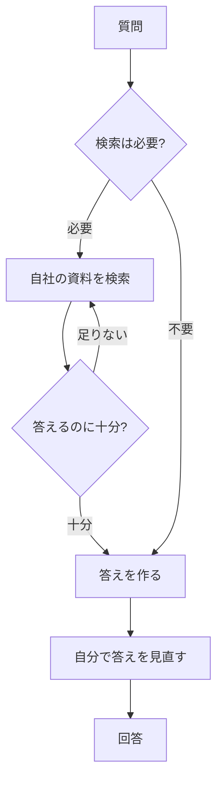

AI に「うちの会社の強みをまとめて」と頼むと、当たり障りのない一般論が返ってくる。
そんな経験はありませんか。

当然といえば当然で、<mark>AI はあなたの会社の中身を知らない</mark>からです。
知っているのは、世の中に広く出回っている一般的な知識だけ。

そこを埋めるのが RAG（ラグ）です。
ひとことでいえば、<mark>AI に自分の資料を見せてから答えさせるしくみ</mark>。

この記事では、RAG の基本の流れから、最近よく耳にする「エージェント型 RAG」、そして前回の記事で触れた [MCP](/blog/mcp-server-toha/) との違いまで、順にほどいていきます。

## AI が「一般論」しか返さないわけ

AI（大規模言語モデル）は、学習した膨大な文章から「それらしい続き」を作るのが得意です。
でも、その学習の中に、あなたの会社の見積書も、現場のノウハウも、昨日の議事録も入っていません。

だから現場の中身を渡さずに書かせたコラムは、どこかで読んだような一般論になりがちです。

これは私自身、はっきり感じたところです。
会社の紹介文を AI に書かせても、最初は「高品質・低価格・信頼」みたいな、どの会社にも当てはまる言葉しか出ませんでした。
自社だけの一次データ（実際の実績や現場の工夫）を渡してはじめて、問い合わせにつながる文章になりました。

つまり答えの質は、AI の賢さより<mark>「何を見せたか」で大きく変わる</mark>のです。
RAG は、この「見せる」を自動でやってくれる考え方です。

## RAG は「見せてから答えさせる」

RAG は Retrieval-Augmented Generation の略で、日本語なら「検索で補って答える」くらいの意味です。
むずかしそうな名前ですが、やっていることは素直です。

図のように、二段構えになっています。

- **検索（Retrieval）**：質問に関係する部分を、自社の資料の山から抜き出す。
- **生成（Generation）**：抜き出した部分を AI に読ませ、それを根拠に答えさせる。

イメージとしては、暗記だけで挑む試験ではなく、<mark>手元のカンペを見ながら答える試験</mark>に近いです。
資料を見て答えるので、ぐっと的外れが減ります。

根拠を見せる分、でたらめな作文も起きにくくなります。とはいえゼロにはならないので、[AI のハルシネーション（もっともらしい嘘）](/blog/ai-hallucination-toha/) の備えは引き続き必要です。
また、見せる資料に顧客情報などが混じるときは [AI に入れてはいけない情報](/blog/ai-kojinjoho-chuiten/) の線引きも忘れずに。

## 最近の話題、エージェント型 RAG

ここ最近よく話に出るのが「エージェント型 RAG（agentic RAG）」です。
私が出たハッカソンでも、RAG と [OCR（画像から文字を読み取る技術）](/blog/ai-ocr-mojiyomitori/) はもはや前提の道具として、当たり前のように話題にのぼっていました。

従来の RAG は、基本が一本道でした。
「一回検索して、一回答える」。最初の検索が外すと、そのまま答えの質も落ちます。

エージェント型は、ここに [AI エージェント](/blog/ai-agent-toha/) の考え方を持ち込みます。

AI 自身が「そもそも検索が要るか」「何を検索するか」「集めた情報で足りるか」を判断し、足りなければもう一度検索する。
一本道だった処理が、<mark>状況に応じて自分で組み立てる動き</mark>に変わります。

そのぶん精度は上がりやすい一方、検索を何度も繰り返すので手間もコストも増えます。ここは目的次第の使い分けです。

## 「RAG はもう不要」は本当か

RAG の話をすると、必ず「コンテキスト窓が大きくなったから RAG はもう死んだ」という声が出ます。
資料を全部まとめて貼れるなら、わざわざ検索しなくていい、という理屈です。

結論からいうと、<mark>この見方は言いすぎ</mark>です。

- **コストと速さ**：毎回すべて貼るより、必要な部分だけ検索して渡すほうが、桁違いに安く速いことが多い。
- **精度**：長い資料の真ん中に大事な一文があると、AI が見落としやすい。検索で先に絞ると、注意がそこに集まる。

実際、コンテキスト窓が広がった今も RAG の利用はむしろ伸びています。
最近の定番は、検索で候補を絞ってから、広いコンテキストを持つモデルにじっくり考えさせる「いいとこ取り」のやり方です。

流行りの「◯◯は死んだ」に飛びつかず、安いか・速いか・正確かで選ぶ。
これが地に足のついた判断だと思います。

## MCP と RAG は競合しない

前回の記事で MCP（AI に外の道具をつなぐ差込口）を扱ったので、「RAG と何が違うの？」と迷うかもしれません。
両者はよく比べられますが、じつは<mark>解いている問題が別</mark>です。

| 観点 | RAG | MCP |
| --- | --- | --- |
| ひとことで | 資料を見せて答えさせる | AI を外の道具につなぐ |
| 答えるのは | 自社の資料は何と言っているか | AI が外の世界へどう手を伸ばすか |
| 役割 | 見せる中身（知識）を用意する | つなぐ道（差込口）を用意する |
| たとえ | カンペを渡す | 道具箱への差込口をつける |

つまり競合ではなく、補い合う関係です。
MCP でデータ源につなぎ、その中から RAG で関連部分を取り出して答えさせる、という合わせ技もよく使われます。

そして大事なのは、RAG でも MCP でも<mark>「何を渡すか」の線引きは同じ</mark>だという点です。
便利だからと生の顧客データや `.env` を渡してよい理由にはなりません。ここは [他人の自作 MCP サーバーに顧客データを渡してよいか](/blog/jisaku-mcp-kokyaku-data/) に詳しくまとめています。

### 実際のところ

正直に書くと、私自身はまだ RAG を本格的に組んだことはありません。
なので「ここはこう詰まる」という深い実体験は、この記事ではまだ出せません（組んだら加筆します）。

ただ、肌で感じていることが二つあります。

ひとつは、さっき書いた「一次データを渡すと文章が化ける」実感。
これは手作業とはいえ、やっていることは RAG とそっくりです。見せる資料しだいで答えが変わる、という手ごたえは本物でした。

もうひとつは、ハッカソンでの温度感。
RAG や OCR は、もう特別な最新技術というより<mark>「使えて当たり前」の前提</mark>として語られていました。
入門のうちに流れだけでも押さえておくと、この先ぐっと楽になります。

## よくある疑問

**Q. RAG とファインチューニングは何が違いますか？**
RAG は答えるたびに資料をその場で見せるやり方、ファインチューニングはモデル自体を追加学習で鍛え直すやり方です。手軽で差し替えがすぐ効くのは RAG です。

**Q. コンテキスト窓が大きくなれば RAG は要らない？**
全部貼るより、必要な部分だけ検索して渡すほうが安く・速く・正確な場面が多いです。長文貼りと検索の組み合わせが主流になっています。

**Q. RAG を使えば AI の嘘は消えますか？**
減らせますが消えはしません。資料にないことを聞けば作文します。答えは資料と照らして裏取りしましょう。

## まとめ

RAG は、身がまえるほど難しい話ではありません。

- AI は自分の会社の中身を知らない。だから一般論しか返らない。
- RAG は「資料を見せてから答えさせる」しくみ。カンペを見ながらの試験に近い。
- エージェント型 RAG は、AI が自分で検索の要否と回数を判断する新しい形。
- 「RAG は死んだ」は言いすぎ。安い・速い・正確で選ぶ。MCP とは補い合う関係。

まずは大がかりな仕組みを作らなくても大丈夫です。
AI に質問するとき、関係する自分の資料を一緒に貼ってみる。この手作業の RAG から始めてみてください。
